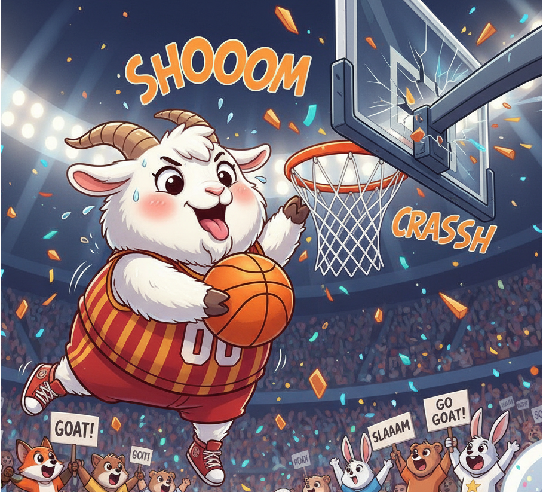

## GOAT Attention

[](https://pypi.org/project/goat-attention/)

[](LICENSE)

Generalized Optimal Transport Attention with Trainable Priors (**GOAT**), presented as a PyTorch multi-head attention module.

> **Install name:** `goat-attention` (PyPI) · **Import name:** `goat`

<p align="center">
  
</p>

## Installation

- **From PyPI (recommended)**:

```bash
uv add goat-attention
```

- **pip**:

```bash
pip install goat-attention
```

- **uv (editable, for development)**:

```bash
uv pip install -e .
```

- **pip (editable, for development)**:

```bash
pip install -e .
```

## Quickstart

```python
import torch
from goat import GoatAttention

B, L, S, E, H = 2, 5, 7, 64, 8
xq = torch.randn(B, L, E)
xk = torch.randn(B, S, E)
xv = torch.randn(B, S, E)

attn = GoatAttention(
    embed_dim=E,
    num_heads=H,
    batch_first=True,
    pos_rank=2,
    abs_rank=4,
    enable_key_bias=True,
)

out, weights = attn(xq, xk, xv, is_causal=False, need_weights=True)
print(out.shape, None if weights is None else weights.shape)
```

## CLI

After installation:

```bash
goat info
goat smoke
```

## Documentation

See `docs/` (MkDocs-ready markdown):

- `docs/index.md`
- `docs/usage.md`
- `docs/api.md`
- `docs/development.md`

## Development

```bash
uv pip install -e ".[dev]"
pytest
```

## License

MIT (see `LICENSE`).

